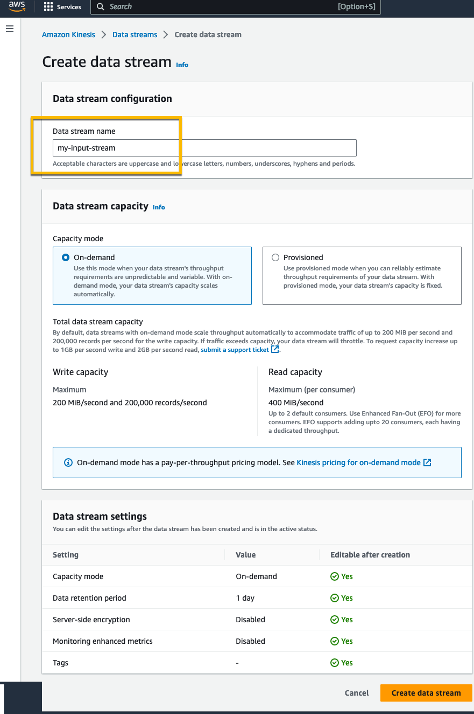
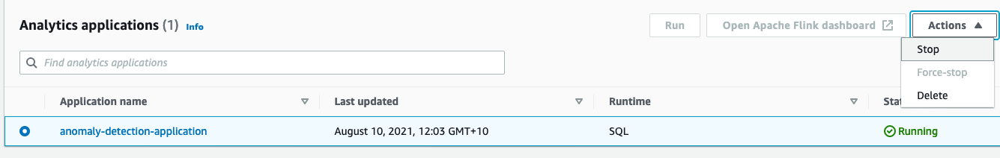
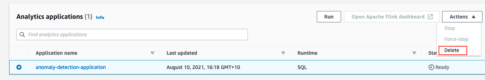
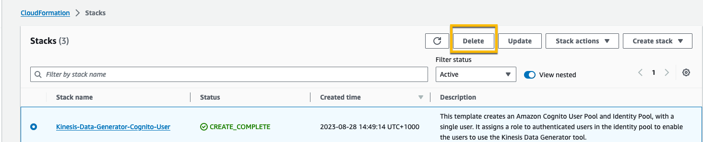

# Real-Time Clickstream Anomaly Detection Kinesis Analytics

This lab is provided as part of **[AWS Innovate Data Edition](https://aws.amazon.com/events/aws-innovate/data/)**,  it has been adapted from an [AWS Workshop](https://catalog.us-east-1.prod.workshops.aws/workshops/976050cc-0606-4b23-b49f-ca7b8ac4b153/en-US/300/320-main-lab)

ℹ️ You will run this lab in your own AWS account and running this lab will incur some costs. Please follow directions at the end of the lab to remove resources to avoid future costs.

## Table of Contents  
* [Overview](#overview)   
* [Create Kinesis Data Stream](#create-kinesis-data-stream)  
* [Create Kinesis Data Generator](#create-kinesis-data-generator)  
* [Sending Data from Kinesis Data Generator](#sending-data-from-kinesis-data-generator)
* [Set Up Kinesis Data Analytics Studio Notebook](#set-up-kinesis-data-analytics-studio-notebook)
* [Cleanup](#cleanup)
* [Conclusion](#conclusion)
* [Survey](#survey)


## Overview
This lab helps you to analyze [streaming data](https://aws.amazon.com/streaming-data/) using [Amazon Kinesis Data Analytics Studio](https://aws.amazon.com/kinesis/data-analytics/features/?nc=sn&loc=2) to get timely insights and react quickly to new information you receive from your business and your applications. 

This is data that must usually be processed sequentially and incrementally on a record-by-record basis or over sliding time windows, and can be used for a variety of analytics including correlations, aggregations, filtering, and sampling.

**Duration** - Approximately 2 hours

## Create Kinesis Data Stream
1. Navigate to [**Amazon Kinesis console**](https://us-east-1.console.aws.amazon.com/kinesis/home?region=us-east-1#/streams)
1. Choose **Create data stream**.
1. For **Data stream name**, enter ```my-input-stream```.
1. For Capacity mode, select On-demand and click **Create Data Stream**

1. Repeat steps above to create another Kinesis Data Stream named ```my-output-stream```

## Create Kinesis Data Generator
1. Click [here](https://console.aws.amazon.com/cloudformation/home?region=us-east-1#/stacks/new?stackName=Kinesis-Data-Generator-Cognito-User&templateURL=https://aws-kdg-tools.s3.us-west-2.amazonaws.com/cognito-setup.json) to start with the CloudFormation stack creation screen. 
Kinesis Data Generator uses a service called Amazon Cognito at the backend for login authentication and authorization of log sending permissions. 
By creating this CloudFormation stack, you can create the necessary Cognito resources.
1. In **"Step 1: Specify template"**, make sure that the Amazon S3 URL where the template source is located has already entered. Click **[Next]** without any changes.
1. In **"Step 2: Specify stack details"**, enter the appropriate value for **"Username"** and **"Password"** for **"Kinesis Data Generator"**. The username and password specified here will be used to log in to Kinesis Data Gnerator later. Once you have entered, click **[Next]**.
1. In **"Step 3: Configure stack options"**, click **[Next]** without any changes.
1. In **"Step 4: Review"**, check the check-box of **"I acknowledge that AWS CloudFormation might create IAM resources with custom names "** at to bottom of the screen, and then click **[Create stack]** button to start the stack creation.
1. Wait for a few minutes until the stack status changes  CREATE_COMPLETE.

## Sending Data from Kinesis Data Generator
1. Choose **[Output]** tab of the CloudFormation stack you have created. You can open the setting screen of Kinesis Data Generator by clicking the URL of **"KinesisDataGeneratorUrl"** displayed.
1. Enter the user name and password you have created in the the above step to **"Username"** and **"Password"** in the top right of the screen, and then login to it.
1. Configure the log transfer setting actually in this step. In **"Region"**, choose **[us-east-1]** ( N. Virginia region), and then choose ```my-input-stream``` you have created earlier in **Stream/delivery stream**.
1. Enter **"5"** to **Records per second** (the number of log records generated per second). This means that 5 records are created per 1 second. As a result 300 records are generated in one minute, and then sent to Kinesis Data Stream.
1. In **"Record template"** below, copy and paste the following codes into **Templete 1** field. This specifies the format for logging sent from clients. 
It automatically generates dummy sensors data to send to client.
```
{
    "sensor_id": {{random.number(150)}},
    "current_temperature": {{random.number(
        {
            "min":10,
            "max":150
        }
    )}},
    "status": "{{random.arrayElement(
        ["OK","FAIL","WARN"]
    )}}",
    "event_time": "{{date.now("YYYY-MM-DDTHH:mm:ss.SSS")}}"
}
```
6. Click **[Send data]** button at last to start sending the data. The Data continues to be sent to Kinesis Data Stream until you click [Stop Sending Data to Kinesis] displayed in the pop-up menu or close the browser tab.

## Set Up Kinesis Data Analytics Studio Notebook
1. From the **Kinesis console**, select **my-input-stream** Kinesis data stream and choose **Process data in real time** from the Process drop-down. In this way, the stream is configured as a source for the notebook.

1. Choose **Apache Flink – Studio notebook** and click **Create**

1. Enter **my-notebook** as name and a description for the notebook. And choose to **Create** an AWS Glue Database

1. In the [AWS Glue console](https://us-east-1.console.aws.amazon.com/glue/home?region=us-east-1#/v2/data-catalog/databases), create an empty database named **my_database**

1. Navigate back to the **Kinesis Data Analytics Studio console**, refresh the list and select the new database. And choose **Create Studio notebook**.

1. In the **Studio notebooks details** section, choose **Edit IAM permissions**

1. In the **Included destinations in IAM policy section**, choose the destination and select **my-output-stream**. Save changes and wait for the notebook to be updated.

1. Now that notebook has been created, choose Run


## Analyze Streaming Data
1. When the notebook is running, choose **Open in Apache Zeppelin** to get access to the notebook and write code in SQL, Python, or Scala to interact with streaming data and get insights in real time.

1. Choose **Import Note** and upload [the following notebook](./scripts/Sensors.zpln) and name it **Sensors**
1. Open the imported note
1. Follow the steps in the Notebook to perform streaming data analysis

## Cleanup
Follow the below steps to cleanup your account to prevent any aditional charges:
* Navigate to the Kinesis Data Analytics application.
* Select the 'anomaly-detection-application' application and click on Stop.
            
* Select the 'anomaly-detection-application' application and click on Delete.
            
* Navigate to the CloudFormation and find the stack that was deployed as part of the pre-requisites.
* Select the stack and delete. This action will delete all the resources that were created as part of the lab and stop incurring charges.
            
            
## Conclusion
Throughout the lab, you've learnt how to use Kinesis Data Analytics Studio to analyze streaming data.

[Streaming ingest and stream processing](https://docs.aws.amazon.com/wellarchitected/latest/analytics-lens/streaming-data-processing.html) is one of the scenarios in the [Well-Architected Framework Data Analytics Lens](https://docs.aws.amazon.com/wellarchitected/latest/analytics-lens/analytics-lens.html)

We highly recommend you to deep dive the [Well-Architected Data Analytics Lens](https://docs.aws.amazon.com/wellarchitected/latest/analytics-lens/analytics-lens.html) to understand the pros and cons of decisions while building analytics systems and workloads on AWS.

## Survey
Let us know what you thought of this session and how we can improve the presentation experience for you in the future by completing this [event session poll](https://amazonmr.au1.qualtrics.com/jfe/form/SV_1U4cxprfqLngWGy?Session=HOL04). Participants who complete the surveys from AWS Innovate Online Conference will receive a gift code for USD25 in AWS credits1, 2 & 3. AWS credits will be sent via email by September 29, 2023.
Note: Only registrants of AWS Innovate Online Conference who complete the surveys will receive a gift code for USD25 in AWS credits via email.

<sup>1</sup>AWS Promotional Credits Terms and conditions apply: https://aws.amazon.com/awscredits/ 

<sup>2</sup>Limited to 1 x USD25 AWS credits per participant.

<sup>3</sup>Participants will be required to provide their business email addresses to receive the gift code for AWS credits.

